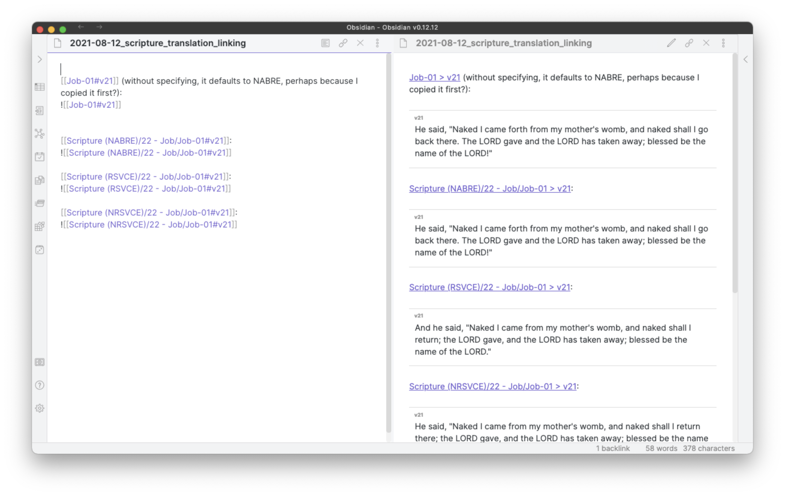
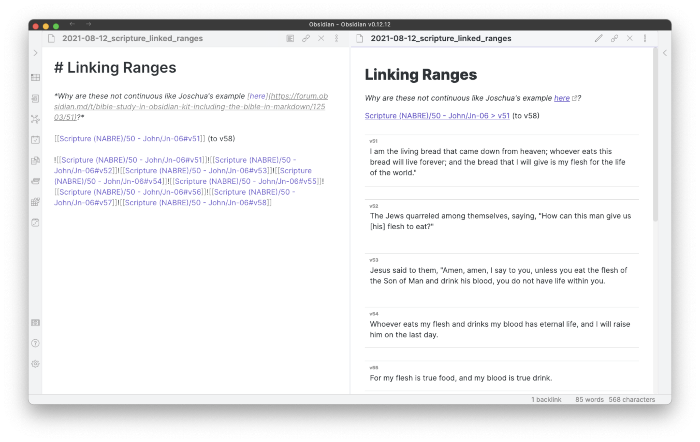

# BibleGateway-to-Obsidian-Catholic

This is a fork of [selfire1/BibleGateway-to-Obsidian](https://github.com/selfire1/BibleGateway-to-Obsidian) to support Catholic translations of the Bible that include the [Deuterocanonical Books](https://matthewkudija.com/notes/Deuterocanonical-Books.html).

### Updates Include
- `bg2md.rb`:
  - Move to same directory as `bg2obs.sh` to run directly, and include various versions of this file for reference or troubleshooting:
    - `bg2md(140).rb`
    - `bg2md(143).rb`
    - `bg2md(144).rb`
- `bg2obs.sh`:
  - Update total book count to 73
  - Update chapter count of Daniel from 12 to 14
  - Update book list for the Catholic bible (source: [USCCB](https://bible.usccb.org/bible))
  - Update abbreviations in `abbarray` to match the USCCB definitions ([page 9](https://www.usccb.org/resources/2021cal_1.pdf))
  - Change default translation from "WEB" to "RSVCE" (I also recommend "NABRE")
  - Add translation to note title to facilitate working with multiple translations in Obsidian
  - Add link to the appropriate Book, Chapter, and Translation page on Bible Gateway
  - Remove args in the bash script and instaed hard-code the desired [jgclark's options](https://github.com/jgclark/BibleGateway-to-Markdown#running-the-script)
    - row 159: `text=$(ruby bg2md.rb -c -l -v "${translation}" ${book} ${chapter})`
  - Update regex to format headers, footnotes, and crossrefs (these are not perfect, but a work in progress)
- `The Bible.md` updates:
  - Update book list for Catholic bible (source: [USCCB](https://bible.usccb.org/bible))


### Setup & Usage

These are the steps I followed to get set up:
- clone this repo
- install missing packages: `sudo gem install colorize optparse clipboard`
- add custom CSS snippet for verse h6 headers using [this link](https://forum.obsidian.md/t/organising-the-bible-in-obsidian/1490/92)
- run the script for various Catholic translations:
  - `bash bg2obs.sh -v NABRE -a` (`-a` to include chapter alias)
  - `bash bg2obs.sh -v NABRE -a -r` (`-r` to exclude crossrefs)
  - `bash bg2obs.sh -v RSVCE -a`
  - `bash bg2obs.sh -v NRSVCE -a`
- copy resulting `Scripture (RSVCE)` to your Obsidian vault


### Known Issues
Most of my testing is with the RSVCE version. Known issues include:
- [ ] Esther 1 drops chapters 11 and 12


### Other To-Dos
- [ ] Add support for NABRE book intros: [example: John](https://www.biblegateway.com/passage/intro/?search=John&version=NABRE)


### Translation and Numbering Notes

- The following Bible Gateway translations are either a Catholic version or appear to have a Catholic includsion of the Deuterocanonical books:
  - [RSVCE](https://www.biblegateway.com/versions/Revised-Standard-Version-Catholic-Edition-RSVCE-Bible/#booklist)
  - [NABRE](https://www.biblegateway.com/versions/New-American-Bible-Revised-Edition-NABRE-Bible/#booklist)
  - [DRA](https://www.biblegateway.com/versions/Douay-Rheims-1899-American-Edition-DRA-Bible/#booklist)
  - [NRSVCE](https://www.biblegateway.com/versions/New-Revised-Standard-Version-Catholic-Edition-NRSVCE-Bible/#booklist)
  - [NRSVACE](https://www.biblegateway.com/versions/New-Revised-Standard-Version-Anglicised-Catholic-Edition-NRSVACE-Bible/#booklist)
  - [GNT](https://www.biblegateway.com/versions/Good-News-Translation-GNT-Bible/#booklist)
- The following Bible Gateway translations include a Protestant-style Apocrypha at the end of the Bible, including various Deuterocanonical books:
  - [CEB](https://www.biblegateway.com/versions/Common-English-Bible-CEB/#booklist)
  - [NRSVA](https://www.biblegateway.com/versions/New-Revised-Standard-Version-Anglicised-NRSVA-Bible/#booklist)
  - [NRSVUE](https://www.biblegateway.com/versions/New-Revised-Standard-Version-Updated-Edition-NRSVue-Bible/#booklist)
  - [RSV](https://www.biblegateway.com/versions/Revised-Standard-Version-RSV-Bible/#booklist)
  - [WYC](https://www.biblegateway.com/versions/Wycliffe-Bible-WYC/#booklist)
- Daniel has 14 books (12 if excluding Greek portions). Daniel 13 is the story of the strength of Susanna; Daniel 14 is Bel and the Dragon and Daneil in the Lion's Den with Habakkuk
- The Greek chapters of Esther are typically included in the existing 10 chapters. In the RSVCE for example, Esther 11 and 12 are inculded at the beginning of chapter 1: https://www.biblegateway.com/passage/?search=Esther+1&version=RSVCE
- 1 & 2 Maccabees are typically placed either at the end of the Old Testament between Malachi and Matthew, or between the Historical and Wisdom books between Esther and Job.
  - RSVCE places them between Esther and Job
  - The Nova Vulgata places them between Malachi and Matthew: https://www.vatican.va/archive/bible/nova_vulgata/documents/nova-vulgata_vetus-testamentum_lt.html
  - *[Liturgiam authenticam](https://www.vatican.va/roman_curia/congregations/ccdds/documents/rc_con_ccdds_doc_20010507_liturgiam-authenticam_en.html)* expresses a preference for following the placement of the Nova Vulgata: "In preparing new translations, it would be helpful, though not obligatory, that the numbering of the verses also follow that of the [*Nova Vulgata Editio*] as closely as possible. (LA 37)"
- There are some inconsistencies in chapter numbering:
  - Joel:
    - [Bible Gateway RSVCE](https://www.biblegateway.com/versions/Revised-Standard-Version-Catholic-Edition-RSVCE-Bible/and most other translations show 3 chapters: 
show 4 chapters
  - Malachi:
    - [Bible Gateway RSVCE](https://www.biblegateway.com/versions/Revised-Standard-Version-Catholic-Edition-RSVCE-Bible/and most other translations show 4 chapters: 
show 3 chapters


### Multiple Translations in Obsidian
It is possible to work with multiple translations in Obsidian by pasting each translation into a separate folder. My `Obsidian` directory in iCloud looks like this, using several translations [recommended by the USCCB](https://www.usccb.org/offices/new-american-bible/approved-translations-bible):

```bash
.
└── Obsidian
    ├── Scripture (NABRE)
    ├── Scripture (NRSVCE)
    └── Scripture (RSVCE)
```

You can then reference multiple translations:


When I use a short filepath (`[[Job-01#v21]]`) rather than the full filepath (`[[Scripture (NABRE)/22 - Job/Job-01#v21]]`) it defaults to the NABRE translation, which I think may be because I copied it into my Obsidian vault first? If you know how Obsidian handles this please <a href="mailto:m.kudija@gmail.com">let me know</a>.

### Linking Ranges
The forum has suggested a couple of options for linking ranges of verses:
- [in line or hyphenated](https://forum.obsidian.md/t/bible-study-in-obsidian-kit-including-the-bible-in-markdown/12503/51)
- [separated by hyphen](https://forum.obsidian.md/t/bible-study-in-obsidian-kit-including-the-bible-in-markdown/12503/76)
- [headers](https://forum.obsidian.md/t/bible-study-in-obsidian-kit-including-the-bible-in-markdown/12503/91)

This is what I tried:


--- 

*the remainder of this README is unchanged from [selfire1/BibleGateway-to-Obsidian](https://github.com/selfire1/BibleGateway-to-Obsidian)*

# BibleGateway-to-Obsidian
This script adapts [jgclark's wonderful BibleGateway-to-Markdown](https://github.com/jgclark/BibleGateway-to-Markdown) script to export for use in [Obsidian](https://obsidian.md/). It accompanies a [Bible Study in Obsidian Kit](https://forum.obsidian.md/t/bible-study-in-obsidian-kit-including-the-bible-in-markdown/12503?u=selfire) that gets you hands-on with using Scripture in your personal notes.

What the script does is fetch the text from [Bible Gateway](https://www.biblegateway.com/) and save it as formatted markdown file. Each chapter is saved as one file and navigation between files as well as a book-file is automatically created. All of the chapter files of a book are saved in its numbered folder.

This script is intended to be as simple as possible to use, even if you have no idea about Scripting. If you have any questions, please reach out to me either on github or Discord (`selfire#3095`).
***
> You can help me keep creating tools like this by [buying me a coffee](https://www.buymeacoffee.com/joschua) ☕️.

<a href="https://www.buymeacoffee.com/joschua" target="_blank"></a>


## Important Disclaimers
* This is not affiliated to, or approved by, BibleGateway.com. In my understanding it fits into the [conditions of usage](https://support.biblegateway.com/hc/en-us/articles/360001398808-How-do-I-get-permission-to-use-or-reprint-Bible-content-from-Bible-Gateway-?) but I make no guarantee regarding the usage of the script, it is at your own disgression.
* By default, the version is set to the [WEB Bible](https://worldenglish.bible/). You can change the version, as long as you honour the copyright standards of different translations of the Bible (See: [BibleGateways overview](https://www.biblegateway.com/versions/)).
* I have little experience in scripting–through this project I taught myself bash and regex basics. If you run into issues or have a way to simplify this script, please raise an issue or reach out on Discord (`selfire#3095`).

## Installation
Here are the tools we are going to use:
* Our command line (Terminal)
* ~A text editor (like [Atom](https://atom.io/)).~
* A text editor is no longer necessary but if you're on Windows you might need to [install perl](https://www.perl.org/get.html).

## Setting ruby up
### Updating
In order to run the scripts, we will need to install ruby. Ruby comes pre-installed on MacOS but if you run into issues, [update to the latest version](https://stackify.com/install-ruby-on-your-mac-everything-you-need-to-get-going/).

### Downloading BibleGateway-to-Markdown.rb
Follow the instructions to download and set up [jgclark's BibleGateway-to-Markdown](https://github.com/jgclark/BibleGateway-to-Markdown).

## Usage
### 1. Install scripts
Put both scripts (`bg2md.rb` and `bg2obs.sh`) in the same directory, open your terminal application, and navigate to that directory with commands like the following:

* `pwd` Show your current directory
* `ls` List all contents in the current directory
* `cd` Enter a subdirectory (e.g., `cd Desktop`)
* `cd ..` Brings you 'up' one directory

### 2. Run the script
Once you have navigated to the directory containing both scripts, run `bash bg2obs.sh`. This will run the bash script.

`NOTE`: In this directory, a folder called `Scripture` with subfolders like `01 - Genesis`, `02 - Exodus` and so on will be created.

Several options are available via command-line switches. Type `bash bg2obs.sh -h` at any time to display them.

#### Script option summary
| Option | Description |
| ------ | ----------- |
| `-v [VERSION]` | Specify the version of the Bible to download (default is WEB) |
| `-b` | Set words of Jesus in bold (default is Off)|
| `-e` | Include editorial headers (default is Off)|
| `-a` | Create an alias in the YAML front matter with a more user-friendly chapter title  (e.g., "Genesis 1") (default is Off)|
| `-i` | Show progress information while the script is running (i.e. "verbose" mode) (default is Off)|
| `-h` | Display help |

#### Example usage
| Command | Description |
| ------- | ----------- | 
|`bash bg2obs.sh -i -v NIV` | Download a copy of the NIV Bible with no other options.|
|`bash bg2obs.sh -b` | Download a copy of the WEB Bible (default) with Jesus' words in bold. |
|`bash bg2obs.sh -v NET -beai` | Download a copy of the NET Bible with all options enabled.|

### 3. Format the text in a text editor

Some crossreferences are sometimes still included, run `\<crossref intro.*crossref\>` to delete.

**There you go!** Now, just move the "Scripture" folder into your Obsidian vault. You can use the provided `The Bible.md` file as an overview file.

## Translations
This script downloads the [World English Bible](https://worldenglish.bible/) by default. If you want to download a different translation, specify the version using the `-v` command-line switch as documented above. The list of abbreviations is available on the [Bible Gateway](https://www.biblegateway.com) site under the version drop-down menu in the search bar.  Make sure to honour copyright guidelines. The script has not been tested with all versions of the Bible available at Bible Gateway, though most of the more commonly-used ones should work.
